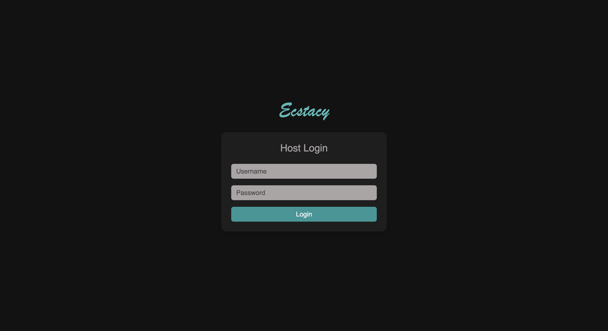
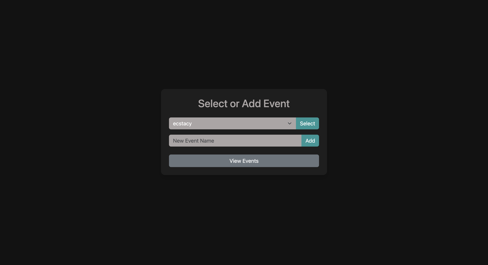
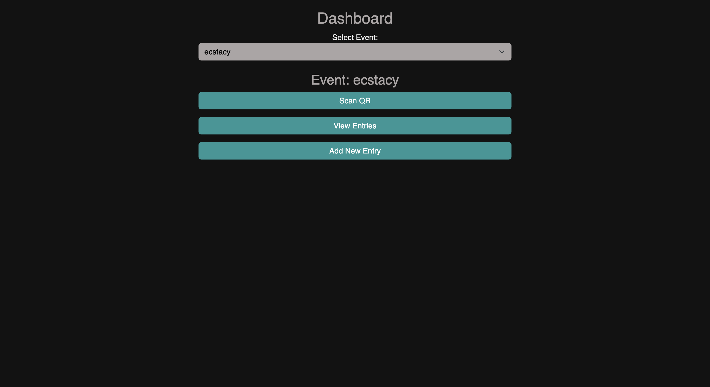
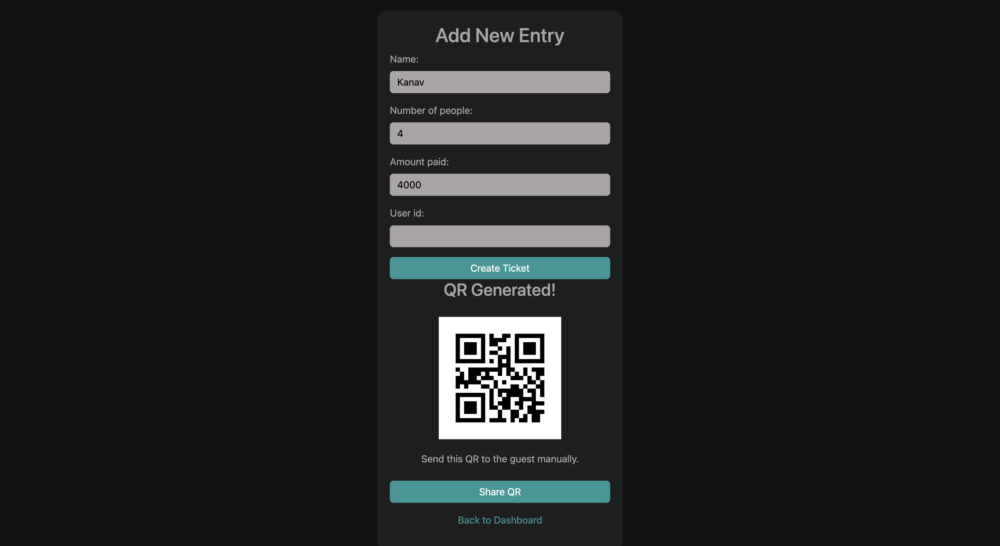
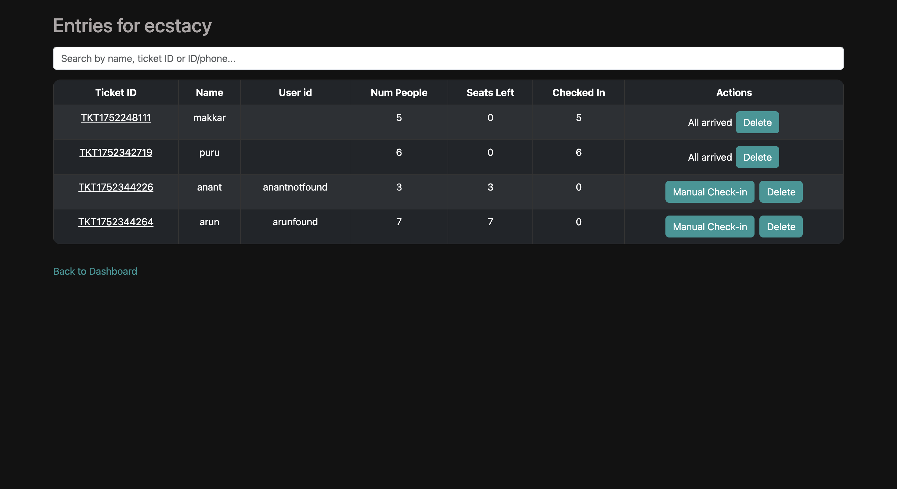
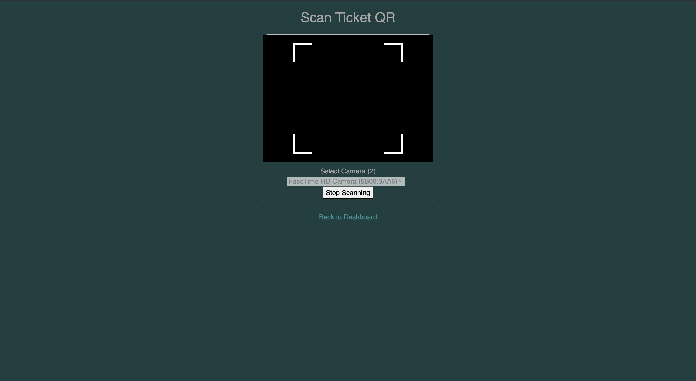

<!-- PROJECT BANNER -->
<p align="center">
  
</p>
<h1 align="center">🎟️ TicketScanner</h1>
<p align="center">
  <b>The Ultimate Event Ticketing & QR Check-in Platform</b><br/>
  <i>Modern, mobile-friendly, and built for event organizers</i>
</p>

<p align="center">
  <a href="https://github.com/aararvav/TicketScanner">
    
  </a>
  <a href="https://github.com/aararvav/TicketScanner/network/members">
    
  </a>
  <a href="#license">
    
  </a>
  <a href="https://www.linkedin.com/in/aaravbir-singh-bhatia/">
    
  </a>
</p>

---

## 📖 Description
> **TicketScanner** is a web-based app for managing event guest lists, generating QR-coded tickets, and streamlining check-in at events. It provides a secure host login, event creation, ticket management, and real-time QR code scanning for efficient guest entry. Designed for event organizers who need a simple, reliable, and fast solution for handling guests and tickets.

---

## ✨ Key Features
- 🔐 **Host Login**: Secure authentication for event hosts
- 🗓️ **Event Management**: Create, view, and delete events
- 🏠 **Dashboard**: Central hub to select events and access all event-related actions
- ➕ **Add Entry**: Add guests, generate unique QR-coded tickets, and share QR codes
- 🖨️ **QR Code Generation**: Automatic QR code creation for each ticket
- 📷 **QR Code Scanning**: Real-time, in-browser QR code scanning for guest check-in
- ✅ **Check-in Management**: Track number of guests checked in and seats left per ticket
- ✋ **Manual Check-in**: Option to manually check in guests if needed
- 📋 **Entry List**: View, search, and manage all entries for an event
- ❌ **Delete Guest**: Remove guests/tickets from the event list
- 🗑️ **Delete Event**: Remove entire events and their associated tickets
- 🔒 **Session Management**: Only logged-in hosts can access event and ticket features
- 💾 **Persistent Storage**: All data stored in a local SQLite database
- 📱 **Responsive UI**: Mobile-friendly, modern interface using Bootstrap

---

## 📸 Screenshots & Demo
Take a visual tour of TicketScanner's core features:

<table>
  <tr>
    <td align="center">
      <b>🔐 Login Page</b><br/>
      
    </td>
    <td align="center">
      <b>🗂️ Select Event</b><br/>
      
    </td>
  </tr>
  <tr>
    <td align="center">
      <b>🏠 Event Dashboard</b><br/>
      
    </td>
    <td align="center">
      <b>➕ Add New Entry & Ticket Creation</b><br/>
      
    </td>
  </tr>
  <tr>
    <td align="center">
      <b>📋 Guest List</b><br/>
      
    </td>
    <td align="center">
      <b>📷 Scan QR Page</b><br/>
      
    </td>
  </tr>
</table>

---

## 🛠️ Tech Stack
<p>
  
  
  
  
  
  
  
  
  
</p>

---

## 🚀 Setup Instructions

### Prerequisites
- 🐍 Python 3.7+
- 📦 pip (Python package manager)
- (Optional) Node.js and npm (for frontend development, if extended)

### 1. Clone the Repository
```bash
git clone https://github.com/aararvav/TicketScanner
cd TicketScanner
```

### 2. Create a Virtual Environment (Recommended)
```bash
python3 -m venv venv
source venv/bin/activate  # On Windows: venv\Scripts\activate
```

### 3. Install Python Dependencies
```bash
pip install flask qrcode
```

### 4. Initialize the Database
Ensure a `database.db` file exists. If not, create it and set up the required tables:
```python
import sqlite3
conn = sqlite3.connect('database.db')
c = conn.cursor()
c.execute('''CREATE TABLE IF NOT EXISTS events (name TEXT PRIMARY KEY)''')
c.execute('''CREATE TABLE IF NOT EXISTS tickets (
    ticket_id TEXT PRIMARY KEY,
    name TEXT,
    num_people INTEGER,
    checked_in INTEGER,
    seats_left INTEGER,
    event TEXT,
    user_id TEXT
)''')
conn.commit()
conn.close()
```

### 5. Run the Application
```bash
python app.py
```
The app will be available at [http://localhost:5050](http://localhost:5050)

---

## 🧑‍💻 Usage Instructions

1. **Login**: Go to `/login` and log in as host (default: username `host`, password `party123`).
2. **Create Event**: Add a new event or select an existing one.
3. **Dashboard**: Access event actions: scan tickets, view entries, add new guests.
4. **Add Entry**: Fill guest details, generate a ticket, and share the QR code.
5. **Scan QR**: Use the in-browser scanner to check in guests at the event entrance.
6. **Manual Check-in**: For guests without QR, use manual check-in from the entries list.
7. **Delete**: Remove guests or events as needed.

### UI Flow
- **Login → Events → Dashboard → [Scan QR | View Entries | Add Entry]**
- **Entries List**: Search, check-in, or delete guests.
- **Scan**: Use device camera to scan QR codes and check in guests.

---

## 📁 Folder Structure Overview
```text
TicketScanner/
│
├── app.py                # Main Flask backend application
├── database.db           # SQLite database file
├── cookies.txt           # Session cookies (for development/testing)
├── static/
│   └── qrcodes/          # Generated QR code images for tickets
├── templates/            # HTML templates for all UI pages
│   ├── add.html          # Add new guest/ticket
│   ├── dashboard.html    # Event dashboard
│   ├── events.html       # Event selection/creation
│   ├── list.html         # List/search/manage entries
│   ├── login.html        # Host login page
│   └── scan.html         # QR code scanner UI
├── frontend/             # (Optional) Frontend assets or future SPA
│   └── package.json      # Placeholder for frontend dependencies
└── README.md             # Project documentation
```

---

<h2 align="center" id="contributors">🤝 Contributors</h2>

<p align="center">We built <strong>TicketScanner</strong> as a collaborative effort. Meet the creators:</p>

<table align="center">
  <thead>
    <tr>
      <th>👤 Name</th>
      <th>🧩 Role</th>
      <th>🌐 Socials</th>
    </tr>
  </thead>
  <tbody>
    <tr>
      <td><strong>Aaravbir Singh Bhatia</strong></td>
      <td>Main Project Lead / Backend</td>
      <td>
        <a href="https://www.linkedin.com/in/aararvav/" target="_blank">🔗 LinkedIn</a> |
        <a href="https://github.com/aararvav" target="_blank">💻 GitHub</a> |
        <a href="https://www.instagram.com/aarav.hehe/" target="_blank">📸 Instagram</a>
      </td>
    </tr>
    <tr>
      <td><strong>Kanav Kumar</strong></td>
      <td>Frontend / Improving UI</td>
      <td>
        <a href="https://www.linkedin.com/in/kanav-kumar-b655962b5/" target="_blank">🔗 LinkedIn</a> |
        <a href="https://github.com/KINGKK-007" target="_blank">💻 GitHub</a> |
        <a href="https://instagram.com/kanavvkumarr" target="_blank">📸 Instagram</a>
      </td>
    </tr>
  </tbody>
</table>

---

## 🔮 Future Scope / Roadmap
- **Major Platform Upgrade** (Work in Progress): Develop a fully web/mobile-friendly website with a significantly improved, modern UI/UX. The goal is to create a one-stop platform for event organizers to:
  - Add and manage new events easily
  - View and analyze revenue and event statistics
  - Access advanced analytics (e.g., guest demographics, check-in rates, real-time attendance)
  - Send tickets directly to customers via email/SMS/other channels
  - Use the same platform for QR code scanning at event entry points
  - Manage guest lists, ticket sales, and event logistics from a unified dashboard
- User registration and role-based access (multiple hosts, guests)
- Email/SMS ticket delivery
- Analytics dashboard for event statistics
- Export guest lists to CSV/Excel
- Mobile app integration
- Enhanced security and OAuth login
- Improved UI/UX and theming
- Integration with payment gateways

---

## 📝 License
[Specify your license here, e.g., MIT, Apache 2.0, etc.]
